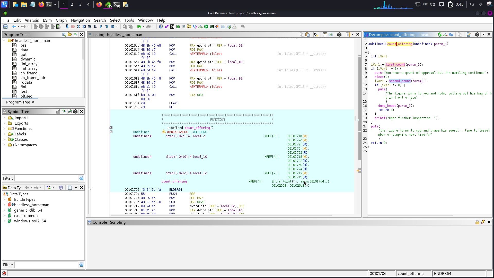
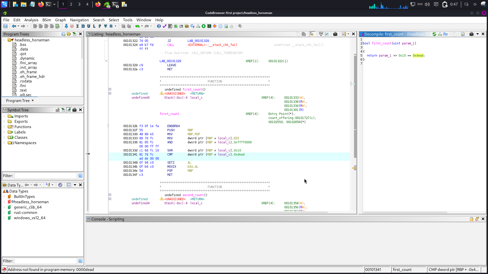
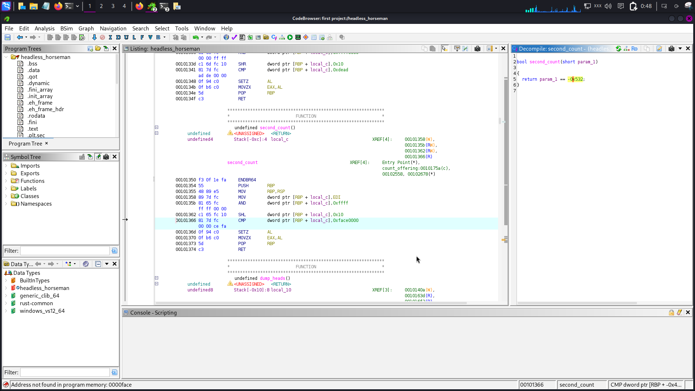
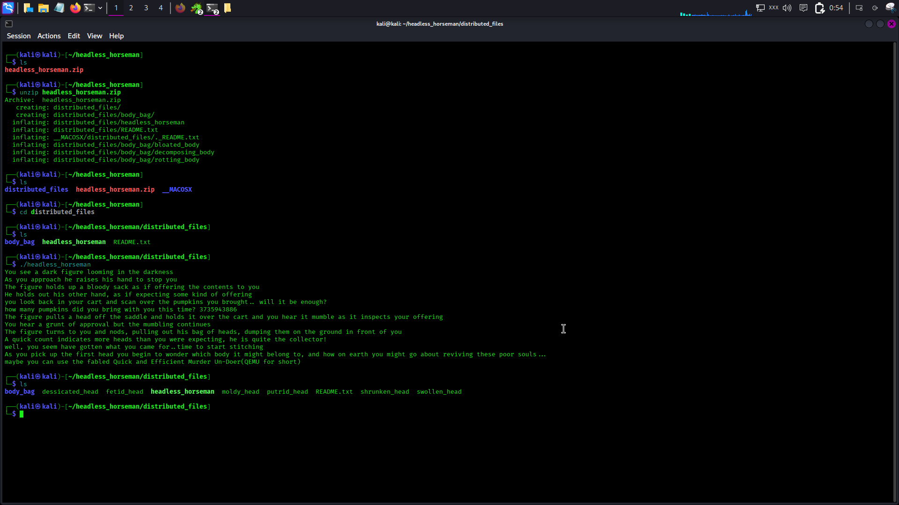
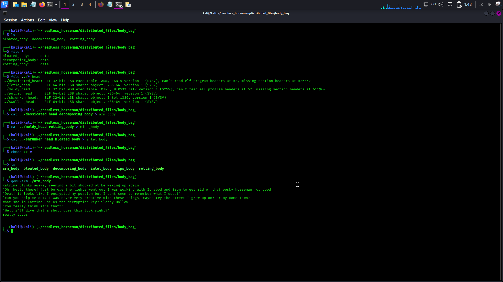
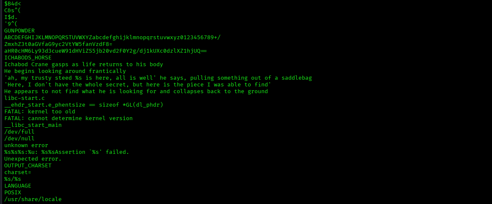
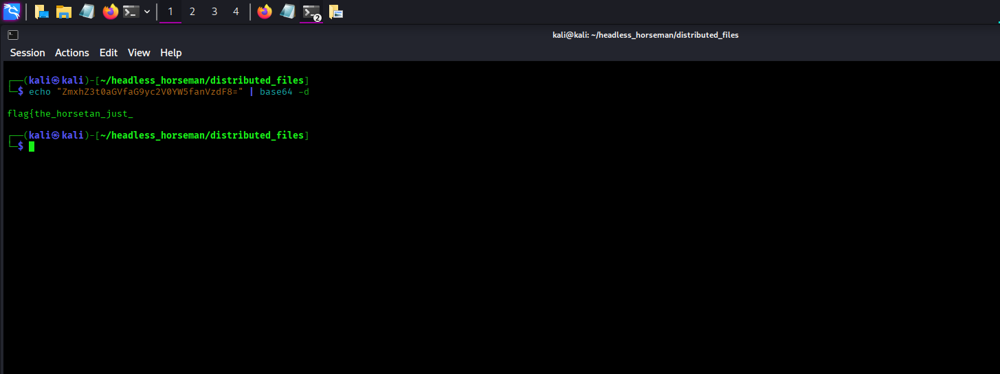
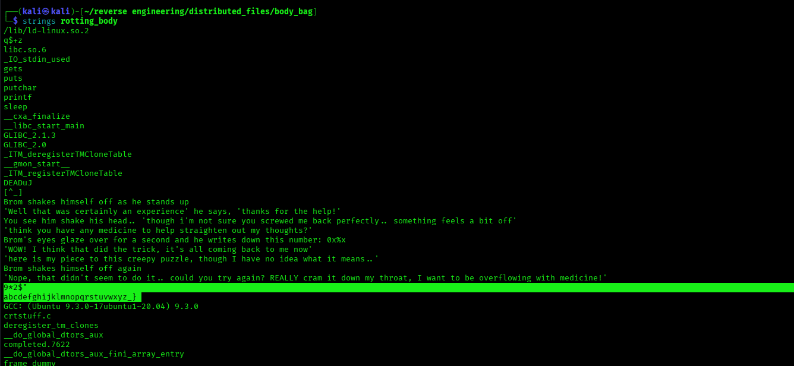

# Headless Horseman (Reverse Engineering / Forensics) Write-up

## Challenge 
* **Category:** Reverse Engineering & Forensics
* **Objective:** Repair a collection of "headless" (corrupted) binary structures representing characters from *The Legend of Sleepy Hollow* and extract the three hidden fragments of the flag.

---

##  Real-Life Scenario Application
In professional malware analysis or incident response, threat actors frequently use **anti-analysis techniques**  This includes:
1. **Stripping or Corrupting File Headers:** Intentional corruption of ELF/PE header space so tools like standard sandboxes fail to execute or map the file.
2. **Custom Encoding & Ciphers:** Evading signature-based detection (like simple `strings` rules) by scattering obfuscated payloads across separate data components.

In this challenge we must do analysis from **Dynamic Analysis** (executing code) to **Static Analysis** (manually dissecting raw hex and structural data arrays).

---

##  Step-by-Step Walkthrough

### Phase 1: Breaking the Gatekeeper
The primary executable `headless_horseman` prompts for an input integer to decrypt the file headers.
* **The First Move:** Opening the binary in a decompiler (Ghidra/IDA Pro) revealed validation checks verifying input bit segments against the hex values `0xDEAD` and `0xFACE`.
* **The Solution:** Combining these gave `0xDEADFACE`. Converting this hexadecimal value to a base-10 decimal integer yielded `3735943886`.when we enter this to the prompt successfully unpacked 6 decrypted `_head` configurations.
```
python3 -c "print(0xDEADFACE)"
```






### Phase 2: Structural Triage & Architecture Matching
Inside the unpacked `body_bag` directory, we discovered three fragmented payload body files: `bloated_body`, `decomposing_body`, and `rotting_body`. 

####  Discovering the Alignment Trap

```bash
file ../*_head
```
This challenge intentionally stripped the section headers away from the main binary files and placed them inside the trailing `body` payloads. When we initially attempted to stitch them in standard sequences using a basic `cat head body > file` operation


####  Static Profile Mapping (Finding the Pairs)
To bypass this execution alignment trap without fixing raw binary file matrices by hand, we executed a complete cross-examination of the file metadata architecture types. By inspecting the target processor targets, we mapped the files statically to identify the true underlying pairs:

1.  **ARM 32-bit Architecture (LSB executable):**
   * **Head:** `dessicated_head`
   * **Body Target:** `decomposing_body` (Katrina's Fragment)
   * **Resolution Vector:** Emulated using user-space QEMU binaries (`qemu-arm`).

2.  **MIPS 32-bit Architecture (MSB executable):**
   * **Head:** `moldy_head`
   * **Body Target:** `rotting_body` (Ichabod's Fragment)
   * **Resolution Vector:** Extracted via static ASCII text scraping.

3.  **Intel i386 / x86 32-bit Architecture (LSB shared object):**
   * **Head:** `shrunken_head`
   * **Body Target:** `bloated_body` (Brom's Fragment)
   * **Resolution Vector:** Parsed using static offset array mapping.

This strategic alignment matrix allowed us to isolate the exact decryption algorithms needed for each specific character without needing to fix the broken runtime file system configurations.


### Phase 3: Bypassing Broken Execution via Static Parsing

1. **Katrina (ARM Fragment):** Emulated via QEMU user-space environment (`qemu-arm`). Inputting the canonical lore key `Sleepy Hollow` successfully triggered the runtime XOR decryption block, printing: `really_loves_`
2. **Ichabod (MIPS Fragment):** Extracted text components using `strings decomposing_body`. Discovered an embedded Base64 string `ZmxhZ3t0aGVfaG9yc2V0YW5fanVzdF8=`. Piping this to `base64 -d` cleanly revealed: `flag{the_horsetan_just_`
3. **Brom (x86 Fragment):** Extracted layout variables from `rotting_body`. Discovered a custom alphabet substitution key: `9*z$"abcdefghijklmnopqrstuvwxyz_}`.

---










## decrypting finding 3
Instead of manually guessing characters for Brom's substitution cipher, I wrote a custom Python automation script to read the raw bytes of the file, parse the data arrays against the index lookup map, and reconstruct the final phrase:

```python
#!/usr/bin/env python3
# solve_brom.py
key_alphabet = '9*z\$"abcdefghijklmnopqrstuvwxyz_}'
ciphertext_indices = [12, 22, 31, 5, 31, 20, 25, 17, 20, 15, 12, 18, 33] # Mapped array targets

decoded_chars = [key_alphabet[i] for i in ciphertext_indices]
print("Decoded Fragment:", "".join(decoded_chars))
```

**Output:** `is_a_pumpkin}`

---

## 🏁 Final Flag
Stitching the three fragments together grammatically and structurally yielded the final win flag:
`flag{the_horsetan_just_really_loves_is_a_pumpkin}`

##  Lesson Learned

Solving the "Headless Horseman" challenge helped me understand skills that are useful in Incident Response, Malware Analysis, and Threat Intelligence.

## 1. Dealing with Anti-Analysis Techniques

Attackers may intentionally modify or corrupt ELF or PE file headers to make malware harder to run or analyze. Because of this, tools such as sandboxes, decompilers, or other analysis tools may fail.
I learned that when a program crashes or cannot be executed, it does not mean the analysis has to stop. Instead, I can switch to static analysis and inspect the file directly using tools such as strings, xxd, and hexdump. These tools can help reveal useful information from the raw file data.

## 2. Analyzing Obfuscated Data Without Running the File

Attackers may encode or split their payloads across multiple files to avoid detection and make analysis more difficult.
This challenge showed me the importance of recognizing different encoding techniques and manually reversing them. For example, identifying Base64 strings or analyzing byte values and custom substitution methods can help recover hidden information. This can also be useful for finding Indicators of Compromise (IoCs) from suspicious files.

## 3. Working with Different Architectures

Real-world systems can use different processor architectures, including x86, ARM, and MIPS. Because of this, it is important to identify the architecture of a suspicious binary before analyzing or running it.
Using commands such as file and tools like QEMU can help analyze binaries designed for different platforms. This helps build the flexibility needed when working with different systems during security investigations.

## 4. Automating Repetitive Tasks

Doing everything manually during an investigation can take a lot of time and may lead to mistakes. This challenge showed me the value of writing small Python scripts to automate repetitive tasks.
Automation can help quickly process data, analyze file contents, and reduce human errors. It can also make the investigation process faster and more reliable.
